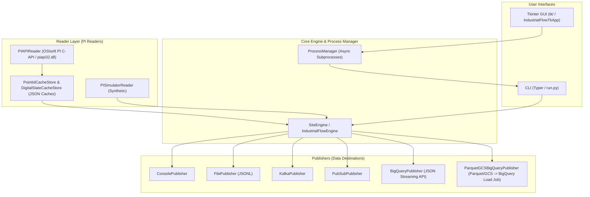

# industrial-flow

Language / Idioma: **English** | [Português (Brasil)](README.pt-BR.md)

**Industrial PI/PIMS data bridge for real-time streaming, historical reconciliation, and PI writebacks.**

`industrial-flow` bridges OSIsoft PI System servers (via native C-API `piapi` or built-in synthetic `simulator`) to modern cloud data environments including **Google Cloud BigQuery**, **Google Cloud Storage (GCS)**, **Google Cloud Pub/Sub**, **Apache Kafka**, and local files (JSONL/Parquet).

---

## Table of Contents

- [Overview and Architecture](#overview-and-architecture)
- [Event Model (TagEvent)](#event-model-tagevent)
- [Quick Start](#quick-start)
- [Installation](#installation)
- [Operation Modes & CLI](#operation-modes--cli)
- [Desktop GUI (Tkinter)](#desktop-gui-tkinter)
- [Configuration Reference (`config/config.yaml`)](#configuration-reference-configconfigyaml)
- [Unified GCP Deployment via `gcloud` CLI](#unified-gcp-deployment-via-gcloud-cli)
- [Development and Testing](#development-and-testing)
- [License](#license)

---

## Overview and Architecture

Automation systems and industrial historians (OSIsoft PI) store vast volumes of time-series process data across manufacturing plants, refineries, and utilities. `industrial-flow` serves as a high-performance data gateway, eliminating manual ETL routines and complex infrastructure overhead.

### High-Level Architecture



### Key Architectural Features

1. **Parallel & Partitioned Extraction**: Tags for each site are grouped into configurable partitions (`tag_partition_size`) and processed in parallel using `ThreadPoolExecutor` (`max_workers`).
2. **Automatic Digital State Resolution**: Transparent mapping of PI digital state integer codes (`digital_code`) to human-readable strings (`digital_state_name`).
3. **Thread-Safe Local Persistence**: Point ID and digital state caches (`.cache/`), as well as local Parquet/JSONL file writes, utilize `threading.Lock` to ensure strict consistency during multi-threaded execution on Windows and Linux.
4. **Optimized D-1 Reconciliation**: For historical data exports, events are consolidated into single per-date/per-site files (`industrial-flow-{partition_date}-{site}.jsonl`), reducing GCS/BigQuery API overhead by 99.8% while executing idempotent BigQuery staging load jobs via `MERGE` SQL statements.

---

## Event Model (`TagEvent`)

All raw values extracted from PI or the simulator are normalized into the standard `TagEvent` structure:

| Field | Type | Description | Example |
| --- | --- | --- | --- |
| `source` | `str` | Reader provider used (`"piapi"` or `"simulator"`) | `"piapi"` |
| `server` | `str` | Origin PI Server hostname/IP | `"PI-SERVER-01"` |
| `site` | `str` | Industrial plant/site identifier | `"site1"` |
| `tag` | `str` | PI Tag/Point name | `"SINUSOID"` |
| `timestamp` | `datetime` | ISO8601 UTC timestamp of the measurement | `"2026-09-05T12:00:00Z"` |
| `value` | `Any` | Measured numeric value or string payload | `42.5` |
| `quality` | `str` | Data quality indicator (`"Good"` or `"Bad"`) | `"Good"` |
| `point_id` | `int \| None` | Internal PI Point ID number | `1024` |
| `value_type` | `str` | Data type (`"Float32"`, `"Digital"`, etc.) | `"Float32"` |
| `digital_code` | `int \| None` | Raw digital state integer code (if applicable) | `None` |
| `digital_set_id` | `int \| None` | PI digital state set ID | `None` |
| `digital_state_id` | `int \| None` | Individual digital state ID | `None` |
| `digital_state_name` | `str \| None` | Resolved textual digital state string | `None` |
| `raw_istat` | `int \| None` | Raw status integer code returned by PI API | `0` |

### Idempotency Key (`event_id`)

Every event contains a deterministic idempotency key calculated via MD5 hash of the key composite fields (`site`, `tag`, `timestamp`). This guarantees that ingestion into BigQuery is deduplicated and idempotent across retries, re-runs, and network interruptions.

---

## Quick Start

Run an instant demonstration in under 2 minutes without needing a live PI Server or cloud credentials.

### 1. Clone Repository and Install Base Dependencies

```bash
git clone https://github.com/terryvel/industrial-flow.git
cd industrial-flow
pip install -r requirements.txt
```

### 2. Validate Default Configuration

```bash
python run.py validate-config --config config/config.yaml
```

### 3. Run Realtime Streaming with Simulator (Console Output)

The default configuration file uses the built-in `simulator` provider and `console` publisher:

```bash
python run.py realtime --config config/config.yaml
```

### 4. Launch Desktop GUI Interface

```bash
python run.py gui
```

---

## Installation

### Requirements

- Python `3.10` or higher.
- Windows (required for native C-API connection via `piapi32.dll` to OSIsoft PI Server) or Linux/macOS (for running with `simulator` or cloud connectors).

### Package Extras

Install extra dependencies depending on your data targets:

```bash
# Base dependencies (Typer, Rich, PyYAML, Pydantic)
pip install -r requirements.txt

# For Google Cloud BigQuery and Cloud Storage support
pip install 'industrial-flow[bigquery]'

# For Google Cloud Pub/Sub support
pip install 'industrial-flow[pubsub]'

# For Apache Kafka support
pip install 'industrial-flow[kafka]'

# Install all optional dependencies at once
pip install 'industrial-flow[all]'
```

---

## Operation Modes & CLI

The CLI is invoked via `run.py` (or the `industrial-flow` installed entrypoint).

```text
Usage: python run.py [COMMAND] [OPTIONS]

Commands:
  validate-config  Validate YAML configuration structure and schema rules.
  realtime         Execute continuous real-time data collection and streaming.
  historical       Execute historical backfill/reconciliation for date ranges.
  writer           Write single values directly to PI Archive or simulator.
  gui              Launch the native desktop graphical user interface (Tkinter GUI).
```

### 1. `validate-config`

Validates configuration against Pydantic models:

```bash
python run.py validate-config --config config/config.yaml
```

### 2. `realtime`

Starts continuous streaming data ingestion:

```bash
# Run using default publisher specified in YAML
python run.py realtime --config config/config.yaml

# Override publisher via command line
python run.py realtime --config config/config.yaml --type bigquery

# Stream data for a specific site
python run.py realtime --config config/config.yaml --site site1 --type pubsub
```

### 3. `historical`

Runs historical data extraction and cloud reconciliation over a date range:

```bash
# Historical reconciliation exporting Parquet to GCS and loading into BigQuery
python run.py historical \
  --config config/config.yaml \
  --start "2026-09-01T00:00:00Z" \
  --end "2026-09-02T00:00:00Z" \
  --type parquet_gcs_bigquery

# Process specific tags for a single site to local Parquet files
python run.py historical \
  --config config/config.yaml \
  --site site1 \
  --tags "SINUSOID,TAG001" \
  --start "2026-09-01T00:00:00Z" \
  --end "2026-09-01T12:00:00Z" \
  --type parquet
```

### 4. `writer`

Writes values directly to PI Archive or simulator tags:

```bash
# Single archive write via CLI
python run.py writer \
  --config config/config.yaml \
  --site site1 \
  --tag "SINUSOID" \
  --timestamp "2026-09-05T12:00:00-03:00" \
  --value 88.5

# Async write without waiting for confirmation
python run.py writer \
  --config config/config.yaml \
  --site site1 \
  --tag "PUMP_SPEED" \
  --value 1200.0 \
  --no-wait
```

### 5. `gui`

Launches native Tkinter desktop interface:

```bash
python run.py gui --config config/config.yaml
# or
python -m tk
# or
python tk/run_tk.py
```

---

## Desktop GUI (Tkinter)

The repository includes a native desktop application in `tk/` designed for service management and visual configuration editing.

### Features

- **Services Manager**:
  - Launch and monitor multiple parallel service executions (`realtime`, `historical`, `writer`).
  - Real-time visual status tracking (`STARTING`, `RUNNING`, `STOPPING`, `STOPPED`, `COMPLETED`, `FAILED`).
  - Edit existing services in stopped state (`Edit Service`).
  - Persistent service catalog saved automatically to `.cache/industrial-flow-tk-services.json`.
- **Configuration Editor**:
  - Tabbed editing interface: `Plant / Site Management`, `Cache`, `Writer`, `Realtime`, and `Historical`.
  - Grouped controls (`ttk.LabelFrame`) separating credentials, Pub/Sub, Kafka, BigQuery, GCS, and Parquet parameters.
  - In-memory validation button with safe YAML formatting preservation.
- **Live Log Inspector**:
  - Timestamped stdout, stderr, and system log inspector window.
  - Auto-scroll controls and graceful subprocess termination.

### GUI Keyboard Shortcuts

| Shortcut | Action |
| --- | --- |
| `n` | Launch modal form for new service |
| `e` | Edit selected service (must be stopped) |
| `s` | Stop selected service |
| `l` | View live log stream for selected service |
| `r` | Restart selected service |
| `F5` | Refresh view / reload configuration |

---

## Configuration Reference (`config/config.yaml`)

Configuration is stored in YAML format and validated via Pydantic (`AppConfig`).

```yaml
# Base PI reader configuration (default provider for single-site execution)
pi:
  provider: "simulator"         # "piapi" (OSIsoft PI C-API) or "simulator" (Synthetic)
  server: "PI-SERVER-01"
  pi_timezone: "America/Sao_Paulo"
  username: ""
  password: ""                  # Can be provided via PI_PASSWORD environment variable
  read_mode: "interpolated"     # "interpolated" or "snapshot"
  timestamp_format: "%d-%b-%y %H:%M:%S"

tags_file: "config/tags.txt"

# Multi-site definition (source of truth when populated)
sites:
  - id: "site1"
    enabled: true
    pi:
      provider: "simulator"
      server: "PI-SERVER-01"
      pi_timezone: "America/Sao_Paulo"
      read_mode: "interpolated"
    tags_file: "config/tags.txt"

# General extraction tuning
read:
  interval_seconds: 60
  window_seconds: 300
  tag_partition_size: 250
  max_workers: 8
  batch_size: 10000
  queue_max_size: 50
  max_publish_retries: 3
  retry_sleep_seconds: 2.0

# Local metadata cache paths
cache:
  point_cache_file: ".cache/industrial-flow-pointids.json"
  digital_state_cache_file: ".cache/industrial-flow-digital-states.json"

# Archive Writer configuration
writer:
  type: "console"               # "console" or "pubsub"
  pubsub:
    project_id: "my-industrial-flow-project"
    subscription_id: "industrial-flow-writer-sub"
    service_account_file: "config/gcp-service-account.json"

# Realtime streaming mode configuration
realtime:
  type: "console"               # Options: console, file, kafka, pubsub, bigquery
  kafka:
    bootstrap_servers: "localhost:9092"
    topic: "industrial-flow.pi-tags"
    client_id: "industrial-flow"
    compression_type: "snappy"
  pubsub:
    project_id: "my-industrial-flow-project"
    topic_id: "industrial-flow-pi-tags"
    ordering_key_by_tag: false
  bigquery:
    project_id: "my-industrial-flow-project"
    dataset: "industrial"
    table: "pi_data"
    service_account_file: "config/gcp-service-account.json"

# Historical reconciliation mode configuration
historical:
  type: "parquet"               # Options: parquet, parquet_gcs, parquet_gcs_bigquery
  parquet:
    output_dir: "output/parquet"
    file_prefix: "industrial-flow"
    compression: "snappy"
  gcs:
    bucket: "my-industrial-flow-bucket"
    prefix: "industrial-flow/parquet"
    service_account_file: "config/gcp-service-account.json"
    delete_local_file_after_upload: true
  bigquery:
    project_id: "my-industrial-flow-project"
    dataset: "industrial"
    table: "pi_data"
    service_account_file: "config/gcp-service-account.json"
```

### Supported Environment Variables

- `PI_PASSWORD`: Password for OSIsoft PI Server authentication (when omitted from YAML).
- `PYTHONIOENCODING`: Set to `utf-8` to ensure consistent character handling in Windows terminals.

---

## Unified GCP Deployment via `gcloud` CLI

This section provides a unified, step-by-step shell guide to deploy all required Google Cloud Platform resources (Google Cloud Storage, BigQuery, Pub/Sub, and IAM permissions) using the **`gcloud` CLI**.

### 1. Set Active GCP Project and Enable APIs

```bash
export GCP_PROJECT_ID="my-industrial-flow-project"
export GCP_REGION="us-central1"
export BQ_LOCATION="US"
export GCS_BUCKET="my-industrial-flow-bucket"

# Set active project
gcloud config set project ${GCP_PROJECT_ID}

# Enable required GCP APIs
gcloud services enable \
  bigquery.googleapis.com \
  storage.googleapis.com \
  pubsub.googleapis.com \
  iam.googleapis.com
```

### 2. Create Cloud Storage Bucket (GCS)

```bash
gcloud storage buckets create gs://${GCS_BUCKET} \
  --location=${GCP_REGION} \
  --uniform-bucket-level-access
```

### 3. Create BigQuery Dataset and Day-Partitioned Table

Create dataset `industrial` and table `pi_data` day-partitioned on the `timestamp` column:

```bash
# Create BigQuery Dataset
bq mk --location=${BQ_LOCATION} --dataset ${GCP_PROJECT_ID}:industrial

# Create BigQuery Table with schema and day partitioning on timestamp
bq mk --table \
  --time_partitioning_field timestamp \
  --time_partitioning_type DAY \
  ${GCP_PROJECT_ID}:industrial.pi_data \
  source:STRING,server:STRING,site:STRING,tag:STRING,timestamp:TIMESTAMP,value:STRING,quality:STRING,point_id:INT64,value_type:STRING,digital_code:INT64,digital_set_id:INT64,digital_state_id:INT64,digital_state_name:STRING,raw_istat:INT64,event_id:STRING,ingestion_timestamp:TIMESTAMP
```

### 4. Create Google Cloud Pub/Sub Resources (Optional)

For realtime streaming or Archive Writer listening:

```bash
# Topic for realtime ingestion
gcloud pubsub topics create industrial-flow-pi-tags

# Subscription for Writer service
gcloud pubsub subscriptions create industrial-flow-writer-sub \
  --topic=industrial-flow-pi-tags
```

### 5. Create Service Account and Export Key JSON

```bash
export SA_NAME="industrial-flow-sa"
export SA_EMAIL="${SA_NAME}@${GCP_PROJECT_ID}.iam.gserviceaccount.com"

# Create Service Account
gcloud iam service-accounts create ${SA_NAME} \
  --display-name="Industrial Flow Service Account"

# Grant required IAM roles
gcloud projects add-iam-policy-binding ${GCP_PROJECT_ID} \
  --member="serviceAccount:${SA_EMAIL}" \
  --role="roles/bigquery.dataEditor"

gcloud projects add-iam-policy-binding ${GCP_PROJECT_ID} \
  --member="serviceAccount:${SA_EMAIL}" \
  --role="roles/bigquery.jobUser"

gcloud projects add-iam-policy-binding ${GCP_PROJECT_ID} \
  --member="serviceAccount:${SA_EMAIL}" \
  --role="roles/storage.objectAdmin"

gcloud projects add-iam-policy-binding ${GCP_PROJECT_ID} \
  --member="serviceAccount:${SA_EMAIL}" \
  --role="roles/pubsub.editor"

# Generate and export JSON credential key
gcloud iam service-accounts keys create config/gcp-service-account.json \
  --iam-account="${SA_EMAIL}"
```

### 6. Update `config/config.yaml` with Credentials

Add `service_account_file: "config/gcp-service-account.json"` to the `realtime`, `historical`, and `writer` sections of your `config/config.yaml` as shown in [Configuration Reference](#configuration-reference-configconfigyaml).

---

## Development and Testing

### Running Unit Tests

`pytest` is used for unit and integration testing:

```bash
# Run test suite
pytest

# Quiet execution
pytest -q
```

### Syntax and Compilation Verification

Verify code syntax and compilation:

```bash
python -m py_compile industrial_flow/*.py industrial_flow/publishers/*.py tk/*.py tk/views/*.py tests/*.py run.py
```

### Repository Structure

```text
industrial-flow/
├── config/                  # YAML configuration files and tag lists
├── industrial_flow/         # Core application package
│   ├── models/              # Dataclass schemas (TagEvent)
│   ├── pi/                  # OSIsoft PI readers (piapi, simulator, caches)
│   ├── publishers/          # Publishers (Console, File, Kafka, PubSub, BigQuery, Parquet)
│   ├── utils/               # Time windowing, batching, and tag utilities
│   ├── cli.py               # CLI entrypoint (Typer)
│   ├── config.py            # Pydantic configuration validation schemas
│   ├── engine.py            # Parallel execution engine
│   └── writer.py            # PI Archive writer service
├── tk/                      # Desktop Tkinter GUI application
│   ├── views/               # GUI views and modals (services, config, detail)
│   ├── app.py               # Main Tkinter application window
│   ├── config_store.py      # YAML config loader and validator for GUI
│   ├── models.py            # Enums and data models for GUI state
│   ├── process_manager.py   # Async subprocess manager
│   └── services_cache.py    # Local JSON service catalog cache
├── tests/                   # Pytest test suite
├── pyproject.toml           # Package metadata and dependencies
├── requirements.txt         # Project dependencies
└── run.py                   # Main CLI script
```

---

## License

This project is licensed under the **GNU General Public License v3.0 (GPL-3.0)**. See the [LICENSE](LICENSE) file for details.
