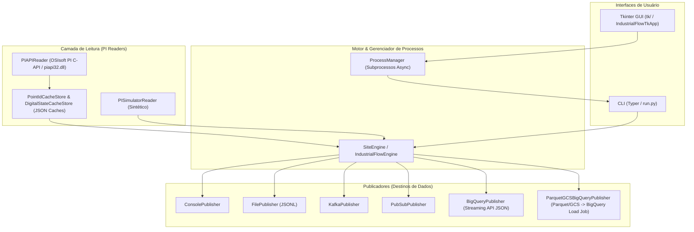

# industrial-flow

Idioma / Language: [English](README.md) | **Português (Brasil)**

**Ponte de dados industriais PI/PIMS para streaming em tempo real, reconciliação histórica e gravação no PI.**

O `industrial-flow` conecta servidores OSIsoft PI System (via C-API `piapi` nativa ou gerador sintético `simulator` embutido) a ambientes modernos de dados em nuvem, incluindo **Google Cloud BigQuery**, **Google Cloud Storage (GCS)**, **Google Cloud Pub/Sub**, **Apache Kafka** e arquivos locais (JSONL/Parquet).

---

## Sumário

- [Visão Geral e Arquitetura](#visão-geral-e-arquitetura)
- [Modelo de Eventos (TagEvent)](#modelo-de-eventos-tagevent)
- [Quick Start](#quick-start)
- [Instalação](#instalação)
- [Modos de Operação e CLI](#modos-de-operação-e-cli)
- [Interface Gráfica Desktop (Tkinter)](#interface-gráfica-desktop-tkinter)
- [Referência de Configuração (`config/config.yaml`)](#referência-de-configuração-configconfigyaml)
- [Deploy Unificado no GCP via `gcloud` CLI](#deploy-unificado-no-gcp-via-gcloud-cli)
- [Desenvolvimento e Testes](#desenvolvimento-e-testes)
- [Licença](#licença)

---

## Visão Geral e Arquitetura

Sistemas de automação e historiadores industriais (OSIsoft PI) armazenam grandes volumes de dados de processo de séries temporais em plantas fabris, refinarias e usinas. O `industrial-flow` atua como um gateway de dados de alta performance, eliminando rotinas manuais de ETL e sobrecargas de infraestrutura.

### Arquitetura de Alto Nível



### Destaques Arquiteturais

1. **Extração Paralela e Particionada**: As tags de cada planta/site são agrupadas em partições configuráveis (`tag_partition_size`) e processadas em paralelo via `ThreadPoolExecutor` (`max_workers`).
2. **Resolução Automática de Estados Digitais**: Mapeamento transparente de códigos inteiros de estados digitais PI (`digital_code`) para descrições textuais legíveis (`digital_state_name`).
3. **Persistência Local Thread-Safe**: Caches de pontos e estados digitais (`.cache/`), bem como escritas em arquivos locais Parquet/JSONL, utilizam `threading.Lock` para garantir consistência durante execuções concorrentes em ambientes Windows e Linux.
4. **Reconciliação Otimizada D-1**: Na exportação histórica de dados, os eventos são consolidados em arquivos únicos por partição de data e site (`industrial-flow-{partition_date}-{site}.jsonl`), reduzindo em 99,8% a quantidade de chamadas de API ao GCS/BigQuery e executando cargas idempotentes via staging tables com `MERGE` SQL no BigQuery.

---

## Modelo de Eventos (`TagEvent`)

Todos os dados brutos extraídos do PI ou do simulador são padronizados na estrutura `TagEvent`:

| Campo | Tipo | Descrição | Exemplo |
| --- | --- | --- | --- |
| `source` | `str` | Provedor de leitura utilizado (`"piapi"` ou `"simulator"`) | `"piapi"` |
| `server` | `str` | Nome do servidor PI de origem | `"PI-SERVER-01"` |
| `site` | `str` | Identificador do site/planta industrial | `"site1"` |
| `tag` | `str` | Nome da tag/ponto no PI | `"SINUSOID"` |
| `timestamp` | `datetime` | Timestamp ISO8601 UTC da medição | `"2026-09-05T12:00:00Z"` |
| `value` | `Any` | Valor numérico medido ou string payload | `42.5` |
| `quality` | `str` | Indicador de qualidade do dado (`"Good"` ou `"Bad"`) | `"Good"` |
| `point_id` | `int \| None` | ID interno do ponto no PI Server | `1024` |
| `value_type` | `str` | Tipo do dado (`"Float32"`, `"Digital"`, etc.) | `"Float32"` |
| `digital_code` | `int \| None` | Código inteiro bruto do estado digital (se aplicável) | `None` |
| `digital_set_id` | `int \| None` | ID do conjunto de estados digitais PI | `None` |
| `digital_state_id` | `int \| None` | ID do estado digital individual | `None` |
| `digital_state_name` | `str \| None` | Descrição textual resolvida do estado digital | `None` |
| `raw_istat` | `int \| None` | Código de status bruto retornado pela API do PI | `0` |

### Chave de Idempotência (`event_id`)

Cada evento possui uma chave de idempotência determinística calculada via hash MD5 dos campos chave (`site`, `tag`, `timestamp`). Isso garante que a ingestão no BigQuery seja deduplicada e idempotente durante reprocessamentos ou falhas de rede.

---

## Quick Start

Execute uma demonstração imediata em menos de 2 minutos sem necessidade de um servidor PI ativo ou credenciais de nuvem.

### 1. Clonar Repositório e Instalar Dependências Base

```bash
git clone https://github.com/terryvel/industrial-flow.git
cd industrial-flow
pip install -r requirements.txt
```

### 2. Validar Configuração Padrão

```bash
python run.py validate-config --config config/config.yaml
```

### 3. Executar Streaming em Tempo Real com Simulador (Console Output)

O arquivo de configuração padrão utiliza o provedor `simulator` e publicador `console`:

```bash
python run.py realtime --config config/config.yaml
```

### 4. Iniciar a Interface Gráfica Desktop

```bash
python run.py gui
```

---

## Instalação

### Requisitos

- Python `3.10` ou superior.
- Windows (requerido para conexão nativa via C-API `piapi32.dll` com OSIsoft PI Server) ou Linux/macOS (para execução com `simulator` ou conectores de nuvem).

### Pacotes Extras

Instale dependências extras conforme os destinos utilizados:

```bash
# Dependências base (Typer, Rich, PyYAML, Pydantic)
pip install -r requirements.txt

# Para suporte a Google Cloud BigQuery e Cloud Storage
pip install 'industrial-flow[bigquery]'

# Para suporte a Google Cloud Pub/Sub
pip install 'industrial-flow[pubsub]'

# Para suporte a Apache Kafka
pip install 'industrial-flow[kafka]'

# Instalar todas as dependências opcionais de uma vez
pip install 'industrial-flow[all]'
```

---

## Modos de Operação e CLI

A CLI é invocada via `run.py` (ou pelo entrypoint instalado `industrial-flow`).

```text
Uso: python run.py [COMANDO] [OPÇÕES]

Comandos:
  validate-config  Valida a estrutura e regras de esquema da configuração YAML.
  realtime         Executa coleta e streaming contínuo em tempo real.
  historical       Executa reconciliação/backfill histórico para intervalos de datas.
  writer           Escreve valores pontuais no arquivo do PI ou simulador.
  gui              Inicia a interface gráfica desktop nativa (Tkinter GUI).
```

### 1. `validate-config`

Valida a configuração contra os modelos Pydantic:

```bash
python run.py validate-config --config config/config.yaml
```

### 2. `realtime`

Inicia a coleta contínua de streaming de dados:

```bash
# Execução usando o publicador padrão configurado no YAML
python run.py realtime --config config/config.yaml

# Sobrescrevendo o publicador via linha de comando
python run.py realtime --config config/config.yaml --type bigquery

# Coletando dados de um site específico
python run.py realtime --config config/config.yaml --site site1 --type pubsub
```

### 3. `historical`

Executa a extração e reconciliação histórica em nuvem para um intervalo de datas:

```bash
# Reconciliação histórica exportando Parquet para GCS e carregando no BigQuery
python run.py historical \
  --config config/config.yaml \
  --start "2026-09-01T00:00:00Z" \
  --end "2026-09-02T00:00:00Z" \
  --type parquet_gcs_bigquery

# Processando tags específicas de um único site para arquivos Parquet locais
python run.py historical \
  --config config/config.yaml \
  --site site1 \
  --tags "SINUSOID,TAG001" \
  --start "2026-09-01T00:00:00Z" \
  --end "2026-09-01T12:00:00Z" \
  --type parquet
```

### 4. `writer`

Escreve valores diretamente em tags do PI Archive ou simulador:

```bash
# Gravação pontual de arquivo via CLI
python run.py writer \
  --config config/config.yaml \
  --site site1 \
  --tag "SINUSOID" \
  --timestamp "2026-09-05T12:00:00-03:00" \
  --value 88.5

# Gravação assíncrona sem aguardar confirmação
python run.py writer \
  --config config/config.yaml \
  --site site1 \
  --tag "PUMP_SPEED" \
  --value 1200.0 \
  --no-wait
```

### 5. `gui`

Inicia a interface desktop nativa em Tkinter:

```bash
python run.py gui --config config/config.yaml
# ou
python -m tk
# ou
python tk/run_tk.py
```

---

## Interface Gráfica Desktop (Tkinter)

O repositório inclui uma aplicação desktop nativa na pasta `tk/` projetada para gerenciamento operacional e edição visual de configurações.

### Recursos

- **Services Manager**:
  - Inicialização e monitoramento de múltiplos subprocessos paralelos (`realtime`, `historical`, `writer`).
  - Acompanhamento visual em tempo real do estado dos serviços (`STARTING`, `RUNNING`, `STOPPING`, `STOPPED`, `COMPLETED`, `FAILED`).
  - Edição de serviços existentes em estado parado (`Edit Service`).
  - Catálogo persistente salvo automaticamente no arquivo local `.cache/industrial-flow-tk-services.json`.
- **Configuration Editor**:
  - Interface de edição por abas: `Plant / Site Management`, `Cache`, `Writer`, `Realtime` e `Historical`.
  - Agrupamento visual de controles (`ttk.LabelFrame`) separando credenciais, Pub/Sub, Kafka, BigQuery, GCS e Parquet.
  - Botão de validação em memória com preservação de formatação YAML.
- **Live Log Inspector**:
  - Janela de inspeção de logs com marcas temporais para `stdout`, `stderr` e eventos do sistema.
  - Controle de rolagem automática e encerramento gracioso de subprocessos.

### Atalhos de Teclado da Interface GUI

| Atalho | Ação |
| --- | --- |
| `n` | Abrir formulário para novo serviço |
| `e` | Editar serviço selecionado (deve estar parado) |
| `s` | Parar serviço selecionado |
| `l` | Visualizar logs ao vivo do serviço selecionado |
| `r` | Reiniciar serviço selecionado |
| `F5` | Recarregar visualização / atualizar dados |

---

## Referência de Configuração (`config/config.yaml`)

A configuração é salva em formato YAML e validada via Pydantic (`AppConfig`).

```yaml
# Configuração base do leitor PI (provedor padrão para execução single-site)
pi:
  provider: "simulator"         # "piapi" (OSIsoft PI C-API) ou "simulator" (Sintético)
  server: "PI-SERVER-01"
  pi_timezone: "America/Sao_Paulo"
  username: ""
  password: ""                  # Pode ser informada via variável de ambiente PI_PASSWORD
  read_mode: "interpolated"     # "interpolated" ou "snapshot"
  timestamp_format: "%d-%b-%y %H:%M:%S"

tags_file: "config/tags.txt"

# Definição multi-site (fonte da verdade quando preenchida)
sites:
  - id: "site1"
    enabled: true
    pi:
      provider: "simulator"
      server: "PI-SERVER-01"
      pi_timezone: "America/Sao_Paulo"
      read_mode: "interpolated"
    tags_file: "config/tags.txt"

# Ajustes gerais de extração
read:
  interval_seconds: 60
  window_seconds: 300
  tag_partition_size: 250
  max_workers: 8
  batch_size: 10000
  queue_max_size: 50
  max_publish_retries: 3
  retry_sleep_seconds: 2.0

# Caminhos de cache de metadados locais
cache:
  point_cache_file: ".cache/industrial-flow-pointids.json"
  digital_state_cache_file: ".cache/industrial-flow-digital-states.json"

# Configuração do serviço gravador de arquivo (Writer)
writer:
  type: "console"               # "console" ou "pubsub"
  pubsub:
    project_id: "my-industrial-flow-project"
    subscription_id: "industrial-flow-writer-sub"
    service_account_file: "config/gcp-service-account.json"

# Configuração do modo streaming em tempo real
realtime:
  type: "console"               # Opções: console, file, kafka, pubsub, bigquery
  kafka:
    bootstrap_servers: "localhost:9092"
    topic: "industrial-flow.pi-tags"
    client_id: "industrial-flow"
    compression_type: "snappy"
  pubsub:
    project_id: "my-industrial-flow-project"
    topic_id: "industrial-flow-pi-tags"
    ordering_key_by_tag: false
  bigquery:
    project_id: "my-industrial-flow-project"
    dataset: "industrial"
    table: "pi_data"
    service_account_file: "config/gcp-service-account.json"

# Configuração do modo de reconciliação histórica
historical:
  type: "parquet"               # Opções: parquet, parquet_gcs, parquet_gcs_bigquery
  parquet:
    output_dir: "output/parquet"
    file_prefix: "industrial-flow"
    compression: "snappy"
  gcs:
    bucket: "my-industrial-flow-bucket"
    prefix: "industrial-flow/parquet"
    service_account_file: "config/gcp-service-account.json"
    delete_local_file_after_upload: true
  bigquery:
    project_id: "my-industrial-flow-project"
    dataset: "industrial"
    table: "pi_data"
    service_account_file: "config/gcp-service-account.json"
```

### Variáveis de Ambiente Suportadas

- `PI_PASSWORD`: Senha de autenticação do servidor OSIsoft PI (quando omitida do YAML).
- `PYTHONIOENCODING`: Definido como `utf-8` para garantir o manuseio correto de caracteres no terminal Windows.

---

## Deploy Unificado no GCP via `gcloud` CLI

Esta seção fornece um guia passo a passo em shell para criar todos os recursos necessários no Google Cloud Platform (Google Cloud Storage, BigQuery, Pub/Sub e permissões IAM) utilizando a ferramenta **`gcloud` CLI**.

### 1. Definir Projeto GCP Ativo e Habilitar APIs

```bash
export GCP_PROJECT_ID="my-industrial-flow-project"
export GCP_REGION="us-central1"
export BQ_LOCATION="US"
export GCS_BUCKET="my-industrial-flow-bucket"

# Definir o projeto ativo
gcloud config set project ${GCP_PROJECT_ID}

# Habilitar APIs necessárias do GCP
gcloud services enable \
  bigquery.googleapis.com \
  storage.googleapis.com \
  pubsub.googleapis.com \
  iam.googleapis.com
```

### 2. Criar Bucket no Cloud Storage (GCS)

```bash
gcloud storage buckets create gs://${GCS_BUCKET} \
  --location=${GCP_REGION} \
  --uniform-bucket-level-access
```

### 3. Criar Dataset e Tabela Particionada por Dia no BigQuery

Cria o dataset `industrial` e a tabela `pi_data` particionada por dia na coluna `timestamp`:

```bash
# Criar Dataset no BigQuery
bq mk --location=${BQ_LOCATION} --dataset ${GCP_PROJECT_ID}:industrial

# Criar Tabela no BigQuery com esquema e particionamento diário por timestamp
bq mk --table \
  --time_partitioning_field timestamp \
  --time_partitioning_type DAY \
  ${GCP_PROJECT_ID}:industrial.pi_data \
  source:STRING,server:STRING,site:STRING,tag:STRING,timestamp:TIMESTAMP,value:STRING,quality:STRING,point_id:INT64,value_type:STRING,digital_code:INT64,digital_set_id:INT64,digital_state_id:INT64,digital_state_name:STRING,raw_istat:INT64,event_id:STRING,ingestion_timestamp:TIMESTAMP
```

### 4. Criar Recursos no Google Cloud Pub/Sub (Opcional)

Para streaming em tempo real ou escuta do serviço Writer:

```bash
# Tópico para ingestão em tempo real
gcloud pubsub topics create industrial-flow-pi-tags

# Assinatura para o serviço Writer
gcloud pubsub subscriptions create industrial-flow-writer-sub \
  --topic=industrial-flow-pi-tags
```

### 5. Criar Conta de Serviço e Exportar Chave JSON

```bash
export SA_NAME="industrial-flow-sa"
export SA_EMAIL="${SA_NAME}@${GCP_PROJECT_ID}.iam.gserviceaccount.com"

# Criar Conta de Serviço
gcloud iam service-accounts create ${SA_NAME} \
  --display-name="Industrial Flow Service Account"

# Atribuir funções IAM necessárias
gcloud projects add-iam-policy-binding ${GCP_PROJECT_ID} \
  --member="serviceAccount:${SA_EMAIL}" \
  --role="roles/bigquery.dataEditor"

gcloud projects add-iam-policy-binding ${GCP_PROJECT_ID} \
  --member="serviceAccount:${SA_EMAIL}" \
  --role="roles/bigquery.jobUser"

gcloud projects add-iam-policy-binding ${GCP_PROJECT_ID} \
  --member="serviceAccount:${SA_EMAIL}" \
  --role="roles/storage.objectAdmin"

gcloud projects add-iam-policy-binding ${GCP_PROJECT_ID} \
  --member="serviceAccount:${SA_EMAIL}" \
  --role="roles/pubsub.editor"

# Gerar e exportar chave de credenciais em formato JSON
gcloud iam service-accounts keys create config/gcp-service-account.json \
  --iam-account="${SA_EMAIL}"
```

### 6. Atualizar `config/config.yaml` com as Credenciais

Adicione `service_account_file: "config/gcp-service-account.json"` nas seções `realtime`, `historical` e `writer` do seu `config/config.yaml` conforme mostrado na seção [Referência de Configuração](#referência-de-configuração-configconfigyaml).

---

## Desenvolvimento e Testes

### Executando Testes Unitários

O `pytest` é utilizado para testes unitários e de integração:

```bash
# Executar a suíte de testes
pytest

# Execução silenciosa
pytest -q
```

### Verificação de Sintaxe e Compilação

Verifique a sintaxe e compilação do código:

```bash
python -m py_compile industrial_flow/*.py industrial_flow/publishers/*.py tk/*.py tk/views/*.py tests/*.py run.py
```

### Estrutura do Repositório

```text
industrial-flow/
├── config/                  # Arquivos de configuração YAML e listas de tags
├── industrial_flow/         # Pacote principal da aplicação
│   ├── models/              # Esquemas de dataclasses (TagEvent)
│   ├── pi/                  # Leitores OSIsoft PI (piapi, simulator, caches)
│   ├── publishers/          # Publicadores (Console, File, Kafka, PubSub, BigQuery, Parquet)
│   ├── utils/               # Utilitários de janela de tempo, batching e tags
│   ├── cli.py               # Entrypoint da CLI (Typer)
│   ├── config.py            # Esquemas de validação de configuração Pydantic
│   ├── engine.py            # Motor de execução paralela
│   └── writer.py            # Serviço gravador no PI Archive
├── tk/                      # Aplicação desktop Tkinter GUI
│   ├── views/               # Telas e modais da GUI (services, config, detail)
│   ├── app.py               # Janela principal da aplicação Tkinter
│   ├── config_store.py      # Carregador e validador de configuração YAML para GUI
│   ├── models.py            # Enums e modelos de dados de estado da GUI
│   ├── process_manager.py   # Gerenciador de subprocessos assíncronos
│   └── services_cache.py    # Cache local do catálogo de serviços em JSON
├── tests/                   # Suíte de testes Pytest
├── pyproject.toml           # Metadados do pacote e dependências
├── requirements.txt         # Dependências do projeto
└── run.py                   # Script principal da CLI
```

---

## Licença

Este projeto é licenciado sob a **GNU General Public License v3.0 (GPL-3.0)**. Consulte o arquivo [LICENSE](LICENSE) para obter detalhes.
